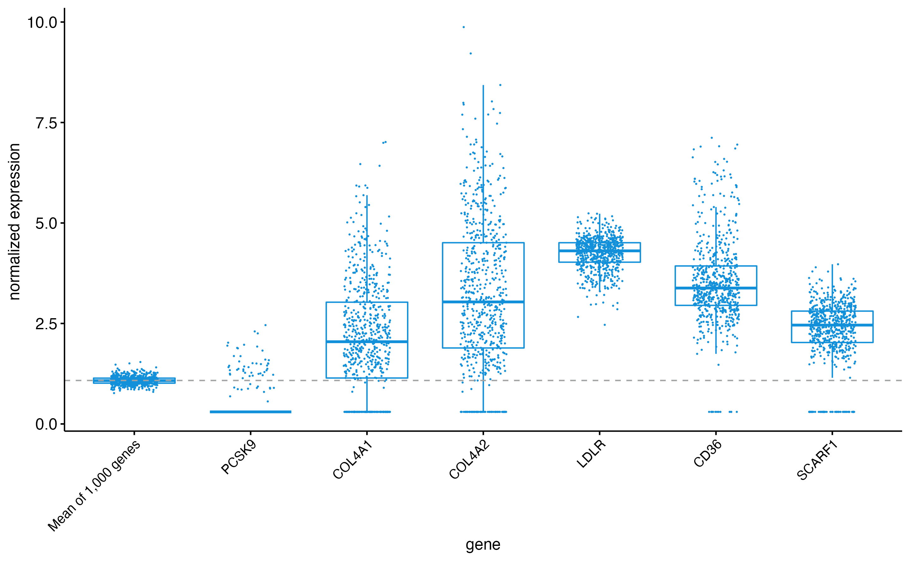

# Plaque expression levels of _HDAC9_ in association with plaque vulnerability traits and secondary vascular events in patients undergoing carotid endarterectomy: an analysis in the Athero-EXPRESS Biobank

*Collaborators*

Yaw Asare, 
Marios Georgakis, 
Martin Dichgans.

*Athero-Express Team*

Sander W. van der Laan, 
Michal Mokry, 
Hester den Ruijter, 
Folkert W. Asselbergs, 
Dominique de Kleijn, 
Gert Jan de Borst, 
Gerard Pasterkamp.

**Project ID** [`AE_20211201_YAW_SWVANDERLAAN_HDAC9`]

## Background

Drug targets supported by human genetics have a higher probability of reaching phase III clinical trials and regulatory approval (Nelson et al, 2015). We and others previously demonstrated a prominence of _HDAC9_ in human atherosclerosis by GWAS in stroke (Malik et al, 2018), CAD and myocardial infarction (Nelson et al, 2017), atherosclerotic aortic calcification (Malhotra et al, 2019), and PAD (Klarin et al, 2019). Despite these striking associations, the mechanisms linking _HDAC9_ to vascular pathologies and the ensuing therapeutic potential were poorly defined. We recently showed that _HDAC9_ is a key regulator of atherosclerotic plaque stability and IKK activation. Specifically, we studied the effects of _Hdac9_ on features of atherosclerotic plaque vulnerability using bone marrow reconstitution experiments and found an increased plaque stability in _Hdac9_-deficient mice. We further demonstrated that HDAC9 binds to the NF-κB activating kinases IKKα and IKKβ, resulting in their deacetylation and subsequent activation, which drives inflammatory responses in both Macrophage and endothelial cells (EC). Pharmacological inhibition of HDAC9 with TMP195 attenuates early lesion formation by limiting myeloid cell recruitment. Gene expression profiling of Macrophage by bulk RNA sequencing revealed that TMP195 downregulates key inflammatory pathways consistent with inhibitory effects on IKKβ. Moreover, therapeutic inhibition with TMP195 reduces atheroprogression and confers plaque stability in advanced lesions. _Ex vivo_ treatment of monocytes from patients with established atherosclerosis reduced the production of inflammatory cytokines including IL-1β and IL-6. Thus, our current findings provide evidence for _HDAC9_ as a causal factor in atherosclerosis and a promising target for interventional studies in humans (Asare et al, 2020).

## Objectives

Against this background, we now aim to make use of the data from Athero-Express Biobank Study to explore the associations of _HDAC9_ expression levels in the atherosclerotic plaques from patients undergoing carotid endarterectomy with phenotypes of plaque vulnerability and secondary vascular events over a follow-up of three years. 

## Study design

### Athero-Express Biobank Study

We will include data from patients with available plaque _HDAC9_ expression levels in **Athero-Express Biobank Study** and genetic data. The [*Athero-Express Biobank Study (AE)*](http://www.atheroexpress.nl){target="_blank"} contains plaque material of patients that underwent endarterectomy at two Dutch tertiary referral centers. Details of the study design were described before. Briefly, blood and plaque material were obtained during endarterectomy and stored at -80 ℃. Only carotid endarterectomy (CEA) patients were included in the present study. All patients provided informed consent and the study was approved by the medical ethics committee. 

### Exposure

_HDAC9_ expression in the plaque, as assessed by bulk (n ± 650) and single-cell RNA sequencing (n ± 40). Depending on the distribution of _HDAC9_ expression levels in the plaque, they might need to be in-transformed.

### Outcomes

We will examine cross-sectional associations between plaque HDAC9 expression and the following plaque vulnerability phenotypes as well as the composite plaque vulnerability index:

1.	Percentage of macrophages (continuous trait)
2.	Percentage of SMCs (continuous trait)
3.	Number of intraplaque microvessels per 3-4 hotspots (continuous trait)
4.	Presence of moderate/heavy calcifications (binary trait)
5.	Presence of moderate/heavy collagen content (binary trait)
6.	Presence of lipid core no/<10% vs. >10% (binary trait)
7.	Presence of intraplaque hemorrhage (binary trait)

1. `calcification`, coded `Calc.bin` no/minor vs. moderate/heavy staining
2. `collagen`, coded `Collagen.bin` no/minor vs. moderate/heavy staining
3. `fat10`, coded `Fat.bin_10` no/<10% fat vs. >10% fat
4. `intraplaque hemorrhage`, coded `IPH.bin` no vs. yes
5. `macrophages (CD68)`, coded `macmean0` mean of computer-assisted calculation CD68+ region of interest
6. `smooth muscle cells (alpha-actin)`, coded `smcmean0` mean of computer-assisted calculation SMA+ region of interest
7. `intraplaque vessel density (CD34)`, coded `vessel_density` manually counted CD34+ cells per 3-4 hotspots
8. `plaque vulnerability index`, scaled from 0 to 4, where 0 is most stable, and 4 is least stable plaque phenotype.

Continuous variables were inverse-rank normal transformated, indicated by `_rankNorm`. 

Furthermore, we will examine in longitudinal analyses the associations between _HDAC9_ expression levels and secondary cardiovascular events over a three-year follow-up period. The primary outcome will be a composite of fatal or non-fatal myocardial infarction, fatal or non-fatal stroke, ruptured aortic aneurysm, fatal cardiac failure, coronary or peripheral interventions, leg amputation due to vascular causes, and cardiovascular death. The secondary outcomes will be incidence of fatal or non-fatal stroke, incidence of acute coronary events (fatal or non-fatal myocardial infarction, coronary interventions), and cardiovascular death.

### Additional variables

1.	Age (continuous in 1-year increment)
2.	Sex (male vs. female)
3.	Presence of hypertension at baseline (defined either as history of hypertension, SBP ≥140 mm Hg, DBP ≥90 mm Hg, or prescription of antihypertensive medications) 
4.	Presence of diabetes mellitus at baseline (defined either as a history of diabetes, administration of glucose lowering medication, HbA1c ≥6.5%, fasting glucose ≥126 mg/dl, or random glucose levels ≥200 mg/dl).
5.	Smoking (current, ex-, never)
6.	LDL-C levels (continuous) 
7.	Use of lipid-lowering drugs
8.	Use of antiplatelet drugs 
9.	eGFR (continuous)
10.	BMI (continuous) 
11.	History of cardiovascular disease (stroke, coronary artery disease, peripheral artery disease)
12.	Level of stenosis (50-70% vs. 70-99%)
13.	Presenting symptoms (asymptomatic, ocular, TIA, or stroke)

### Whole-plaque RNA sequencing

For the expression analysis we used carotid plaque-derived bulk RNAseq data and queried it for the gene list. Below a graph showing the overall expression of the genes (not all are in the data) compared to the mean expression of 1,000 randomly picked genes. 

**Figure 1: Overall expression of target genes in carotid plaques from the Athero-Express Biobank Study**

We assessed the correlation with plaque characteristics (mentioned above) and secondary major adverse cardiovascular events (MACE [major]) at 30 days and 3 years after CEA. 

### Single-cell RNA sequencing

We projected target genes to the single-cell RNAseq data derived from 37 carotid plaque samples. We identified cell communities (Figure 2), mapped and projected target gene expression to the cell communities (Figure 3). 

**Figure 2: Cell communities identified in carotid plaques from the Athero-Express Biobank Study**

**Figure 3: Dotplot showing expression of target genes per cell type in carotid plaques from the Athero-Express Biobank Study**

### Statistical analysis 

We will first compare plaque expression levels of _HDAC9_ across categories of the variables presented in the list above. For continuous traits, we will compare the levels across the following categories: age (years), <55, 55-64, 65-74, 75-84, 85+; LDL-C (mg/dl), <100, 100-129, 130-159, 160-189, 190+; eGFR (ml/min/1.73m2), <30, 30-59, 60-89, 90+; BMI (kg/m2), <18.5, 18.5-24.9, 25-29.9, 30-34.9, 35+ 
Comparisons will be done with the t-test for binary traits and with ANOVA for traits with >2 categories. 

Then we will explore cross-sectional associations between _HDAC9_ expression levels and the plaque vulnerability characteristics. Linear regression models will be used for continuous traits and logistic regression models for binary traits. _HDAC9_ expression levels in the plaque will be added as a continuous variable (per 1-SD increment) and in a secondary approach as a categorical variable in 4 quartiles, with baseline as reference, to test for potential non-linearity in the association. We will have four additive models:

Model 1: adjusted for age and sex

Model 2: adjusted for age, sex, hypertension, diabetes, smoking, LDL-C levels, lipid-lowering drugs, antiplatelet drugs, eGFR, BMI, history of CVD, level of stenosis 

Next, we will explore in logistic regression models associations between _HDAC9_ expression levels in the plaque with symptomatic vs. asymptomatic plaque. As a symptomatic plaque, we will define plaques associated with an ipsilateral ischemic stroke, transient ischemic attach or central retinal artery occlusion. 

To explore the mechanisms underlying these associations we will further examine whether plaque _HDAC9_ expression levels are associated with plaque inflammation and matrix turnover. We will thus examine the age- and sex-adjusted associations of plaque _HDAC9_ expression levels with multiple cytokines and with metalloproteinase activity in carotid plaques. 

Finally, we will explore associations between plaque _HDAC9_ expression levels and secondary cardiovascular endpoints over follow-up (primary and secondary outcomes, as described in the section ‘outcomes’).  We will use Cox proportional hazard models for _HDAC9_ as continuous (per 1SD increment) and categorical trait (in quartiles) taking into account the time between surgery and the occurrence of the events, death, loss to follow-up or completion of follow-up. The same four multivariable models will be used as in the above-mentioned analyses. 

We can present a Kaplan-Meier figure for the primary composite endpoints across the four _HDAC9_ quartiles and the results from the multivariable analyses in a Table. 

For all analyses, the statistical significance threshold is set at a two-sided p<0.05. 

## Where do I start?

You can load this project in RStudio by opening the file called 'AE_20211201_YAW_SWVANDERLAAN_HDAC9.Rproj'.

## Project structure

<!--  You can add rows to this table, using "|" to separate columns.         -->

File                                      | Description                         | Usage         
----------------------------------------  | ----------------------------------- | --------------
README.md                                 | Description of project              | Human editable
AE_TEMPLATE.Rproj                         | Project file                        | Loads project
LICENSE                                   | User permissions                    | Read only
.worcs                                    | WORCS metadata YAML                 | Read only
renv.lock                                 | Reproducible R environment          | Read only
images                                    | image directory for project         | Human editable
bulkRNAseq                                | bulkRNAseq analysis directory       | Human editable
scRNAseq                                  | scRNAseq analysis directory         | Human editable
SNP                                       | SNP analysis directory              | Human editable
SOME_FANCY_PROJECTNAME                    | Some results                        | Human editable
scripts                                   | Scripts directory                   | Human editable

<!--  You can consider adding the following to this file:                    -->
<!--  * A citation reference for your project                                -->
<!--  * Contact information for questions/comments                           -->
<!--  * How people can offer to contribute to the project                    -->
<!--  * A contributor code of conduct, https://www.contributor-covenant.org/ -->

# Reproducibility

This project uses the Workflow for Open Reproducible Code in Science (WORCS) to
ensure transparency and reproducibility. The workflow is designed to meet the
principles of Open Science throughout a research project. 

To learn how WORCS helps researchers meet the TOP-guidelines and FAIR principles,
read the preprint at https://osf.io/zcvbs/

## WORCS: Advice for authors

* To get started with `worcs`, see the [setup vignette](https://cjvanlissa.github.io/worcs/articles/setup.html)
* For detailed information about the steps of the WORCS workflow, see the [workflow vignette](https://cjvanlissa.github.io/worcs/articles/workflow.html)

## WORCS: Advice for readers

Please refer to the vignette on [reproducing a WORCS project]() for step by step advice.
<!-- If your project deviates from the steps outlined in the vignette on     -->
<!-- reproducing a WORCS project, please provide your own advice for         -->
<!-- readers here.                                                           -->

# References

- Asare Y,…(24 coauthors)…,Dichgans M (2020). Histone Deacetylase 9 Activates IKK to Regulate Atherosclerotic Plaque Vulnerability. Circ - Res. 127(6):811-823. PMID: 32546048
- Klarin D et al. (2019). VA Million Veteran Program. Genome-wide association study of peripheral artery disease in the Million Veteran - Program. Nat Med. 25:1274–1279. PMID: 31285632
- Kundaje et al. (2015). Integrative analysis of 111 reference human epigenomes. Nature 518(7539):317-30. PMID: 25693563 
- Lapierre et al. (2016). Histone deacetylase 9 regulates breast cancer cell proliferation and the response to histone deacetylase - inhibitors. Oncotarget 7(15):19693-708. PMID: 26930713
- Magupalli VG et al. (2020). HDAC6 mediates an aggresome-like mechanism for NLRP3 and pyrin inflammasome activation. Science. - 369(6510):eaas8995. PMID: 32943500
- Malhotra R et al. (2019) HDAC9 is implicated in atherosclerotic aortic calcification and affects vascular smooth muscle cell phenotype. - Nat Genet. 51:1580–1587. PMID: 31659325
- Malik R,…(168 coauthors)…, Dichgans M (2018). Multi-ancestry genome-wide association study of 520,000 subjects identifies 32 loci - associated with stroke and stroke subtypes. Nat Genet 50(4):524-537.
- Meng H, Bartholomew B (2018). Emerging roles of transcriptional enhancers in chromatin looping and promoter-proximal pausing of RNA - polymerase II. J Biol Chem. 293:13786–13794. PMID: 29187597
- Nelson CP et al. (2017). Association analyses based on false discovery rate implicate new loci for coronary artery disease. Nat Genet - 49(9):1385-1391. PMID: 28714975
- Nelson MR et al. (2015). The support of human genetic evidence for approved drug indications. Nat Genet. 47:856–860. PMID: 26121088

# Acknowledgements

Dr. Sander W. van der Laan is funded through grants from the Netherlands CardioVascular Research Initiative of the Netherlands Heart Foundation (CVON 2011/B019 and CVON 2017-20: Generating the best evidence-based pharmaceutical targets for atherosclerosis [GENIUS I&II]). We are thankful for the support of the ERA-CVD program ‘druggable-MI-targets’ (grant number: 01KL1802), the EU H2020 TO_AITION (grant number: 848146), and the Leducq Fondation ‘PlaqOmics’.

Plaque samples are derived from carotid endarterectomies as part of the [Athero-Express Biobank Study](http:www/atheroexpress.nl) which is an ongoing study in the UMC Utrecht.

The framework was based on the [`WORCS` package](https://osf.io/zcvbs/).

#### Changes log
    
    _Version:_      v1.1.0 
    _Last update:_  2021-09-29 
    _Written by:_   Sander W. van der Laan (s.w.vanderlaan-2[at]umcutrecht.nl).
        
    * v1.1.0 Major update to WORCS system. 
    * v1.0.6 Small bug fixes. 
    * v1.0.5 Added png for overlap-figure.
    * v1.0.5 Removed obsolete references to objects.
    * v1.0.4 Fixed a mistake in the chr X sample-file creation. Now the order matches the chr X data.
    * v1.0.3 Fixed weight of files (limit of 10Mb per file for templates). Renamed entire repo.
    * v1.0.2 Added sex-specific .sample-files. Added GWASToolKit input-files.
    * v1.0.0 Initial version. Add 'plaque vulnerability index', Fixed baseline table, added codes, and results. Created sample-files. 

------------------------------------------------------------------------

 Copyright © 1979-2022 Sander W. van der Laan \| s.w.vanderlaan-2
[at] umcutrecht [dot] nl. Creative Commons BY-NC-ND 4.0
[license](LICENSE). 

